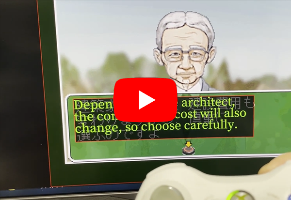
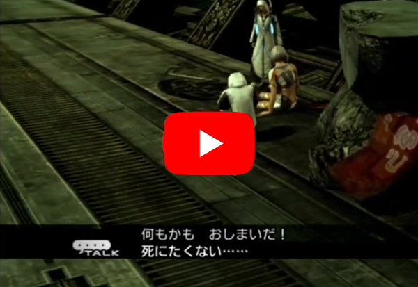

# UGT - Universal Game Translator - Uses Google's Cloud Vision to read and speak dialog from any image/game in any language

# For the user

Full docs/info/more videos:  https://www.codedojo.com/?p=2426

Direct download to Seth's latest Windows 64bit compiled/codesigned build: https://www.rtsoft.com/files/UniversalGameTranslator_Windows.zip

Note: On startup, the app queries https://rtsoft.com/ugt/checking_for_new_version.php and will notify if a newer version exists.  This check can be disabled in the config.txt file.

# For a developer who wants to help me work on this or fork it

This source is C++ and includes a solution/project for Visual Studio 2019.  This will only compile/run on Windows.

Valid builds that are setup are Debug X64 and Release X64

This project requires Proton SDK (a free open source library) as well. To compile UGT, first do some Proton tutorials and make sure are able to compile its example projects.  (like RTSimpleApp)  See https://www.rtsoft.com/wiki/doku.php?id=proton

This project works similar to that, so it should be checked out as a Proton subfolder,
just like those examples.  You should probably change the release build (using the MSVS configuration manager) from FMOD_Release_GL to
Release_GL so Audiere will be used instead of FMOD for the audio, that way you don't have to download FMOD lib stuff to get started.

It's hacked to only work on Windows (due to the low level nature of
writing something that can do screen captures) but in theory those pieces could be
abstracted out to be more platform agnostic.

Special thanks:

* Jari Komppa, I use his webcam lib Escapi (included with Proton to make compiling this easier) https://github.com/jarikomppa/escapi to see his project.

License:  BSD style attribution, see LICENSE.md

Credits and links
- Written by Seth A. Robinson (seth@rtsoft.com) twitter: @rtsoft - [Codedojo](https://www.codedojo.com), Seth's blog
- [Proton SDK wiki/tutorial site](https://www.protonsdk.com)
- Code/bugfix contributions by Meerkov
- [PyUGT](https://github.com/lrq3000/pyugt) by lrq3000 (similar to UGT but works with Linux/OSX also, uses Tesseract locally for the OCR pass)
